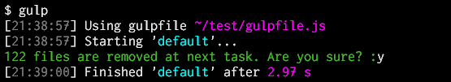
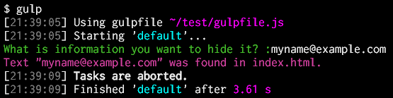

# gulp-confirm

Abort or continue the tasks flow according to an answer to the question, the tasks pause and wait it.

Example:





## Getting Started

```shell
npm install gulp-confirm --save-dev
```

## Usage

`gulpfile.js`

```js
var gulp = require('gulp'),
  confirm = require('gulp-confirm');

gulp.task('default', function() {
  return gulp.src('./develop/*.html')
    .pipe(confirm(options))
    // Other tasks...
    .pipe(gulp.dest('./public_html/'));
});
```

### Options

#### `question`
Type: String or Function

The String that is specified or returned by specified Function is shown to user on screen.  
If specified Function returns falsy (e.g. `null`, `undefined`, `''`, `false` etc.), this task is finished immediately. And the tasks flow is to be continued.

Example:

`gulpfile.js`

```js
gulp.task('default', function() {
  return gulp.src('./develop/*.html')
    .pipe(confirm({
      // Static text.
      question: 'This processing require about 10 minutes. Continue?',
      continue: function(answer) {
        return answer.toLowerCase() === 'y';
      }
    }))
    // Other tasks...
    .pipe(gulp.dest('./public_html/'));
});
```

```js
var pattern = './src/*.html';
gulp.task('default', function() {
  return gulp.src(pattern)
    .pipe(confirm({
      question: function() {
        var files = require('glob').sync(pattern);
        return !files.length ? '' : // No file. And do nothing.
          files.length + ' files are copied at next task. Are you sure?';
      },
      continue: function(answer) {
        return answer.toLowerCase() === 'y';
      }
    }))
    .pipe(gulp.dest('./public_html/'));
});
```

#### `continue`
Type: Boolean or Function

If `false` is specified or specified Function returns falsy (e.g. `null`, `undefined`, `''`, `false` etc.), this tasks flow is aborted immediately. And the remaining tasks will be not done. Otherwise the tasks flow is to be continued.

The specified Function is passed `answer` argument. This is value that was typed by user.  
The Function can determine to abort or continue by using it.

Example:

`gulpfile.js`

```js
gulp.task('default', function() {
  return gulp.src('./develop/*.html')
    .pipe(confirm({
      // Just pause, don't abort. e.g. for show something on screen.
      question: 'Push Enter key to continue.',
      continue: true
    }))
    // Other tasks...
    .pipe(gulp.dest('./public_html/'));
});
```

```js
var pattern = './src/*.*';
gulp.task('default', function() {
  return gulp.src(pattern)
    .pipe(confirm({
      question: 'How many files are required?',
      continue: function(answer) {
        var files = require('glob').sync(pattern);
        if (files.length < +answer) {
          console.log('There are only ' + files.length + ' files.');
          return false;
        } else {
          return true;
        }
      }
    }))
    // Other tasks...
    .pipe(gulp.dest('./pack/'));
});
```

## See Also
+ Highlighting the question text like the images at top of this document may be better. [colors](https://github.com/Marak/colors.js) is useful for that.

```js
require('colors');
gulp.task('default', function() {
  return gulp.src('./develop/*.html')
    .pipe(confirm({
      question: 'Can you see me?'.green.bold,
      continue: true
    }))
    // Other tasks...
    .pipe(gulp.dest('./public_html/'));
});
```

## History
 * 2014-09-23			v0.1.0			Initial release.
